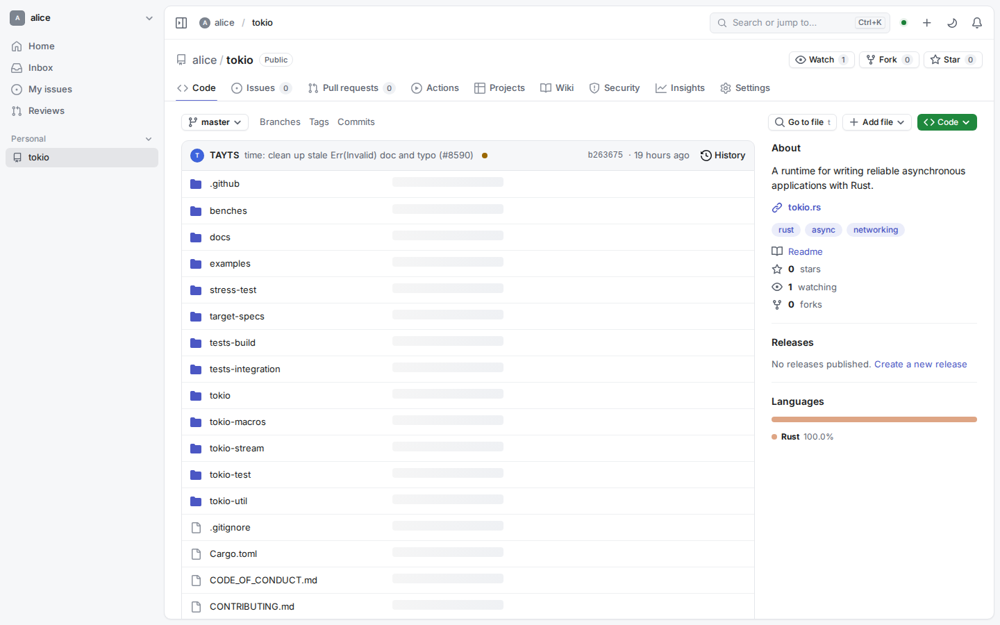
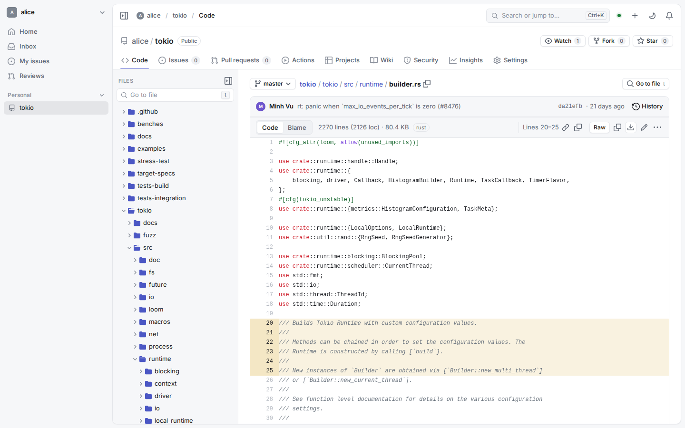
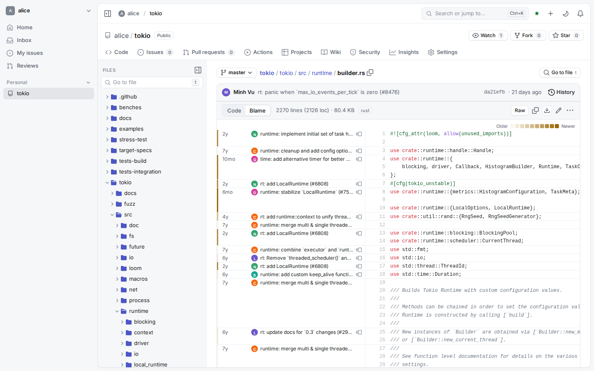
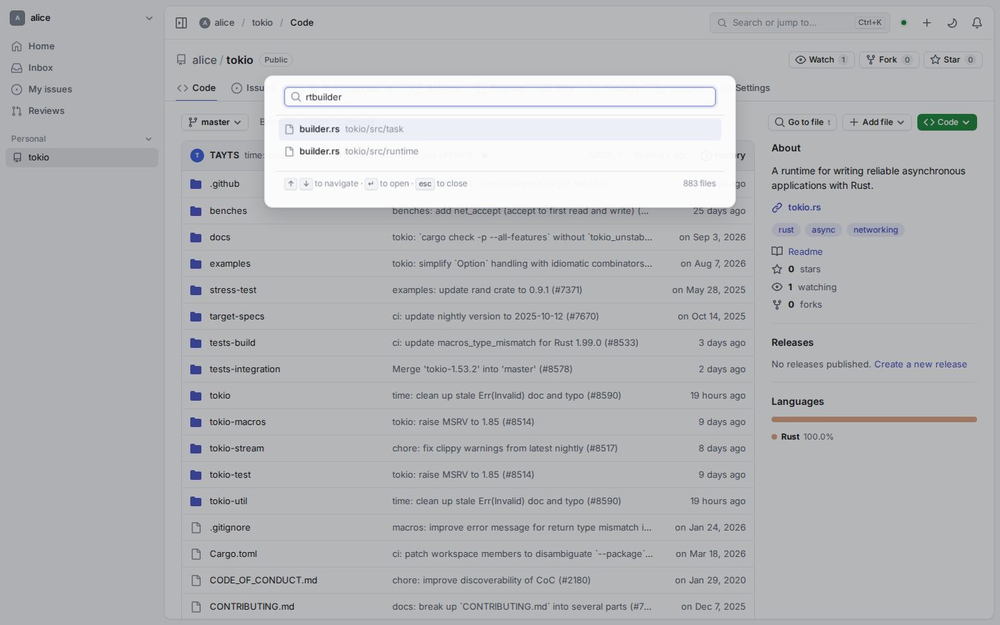
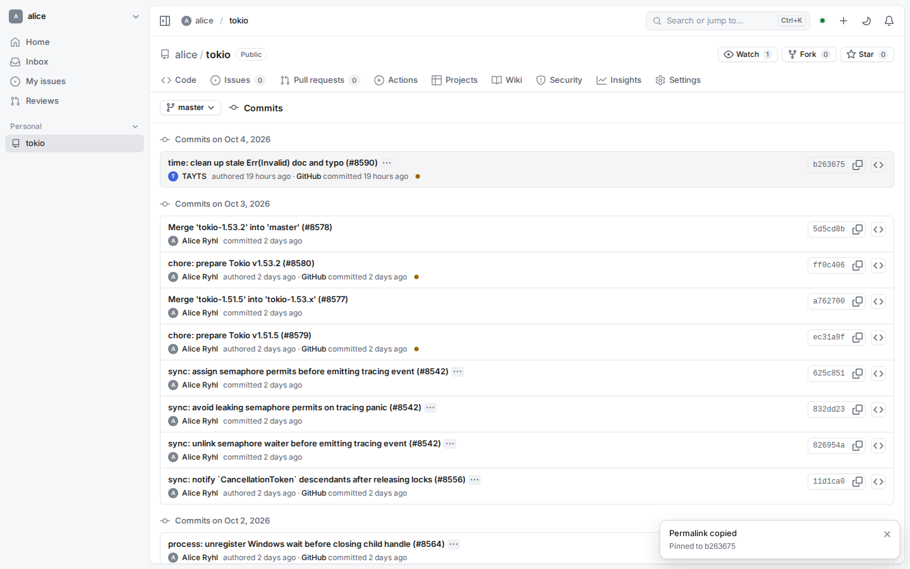
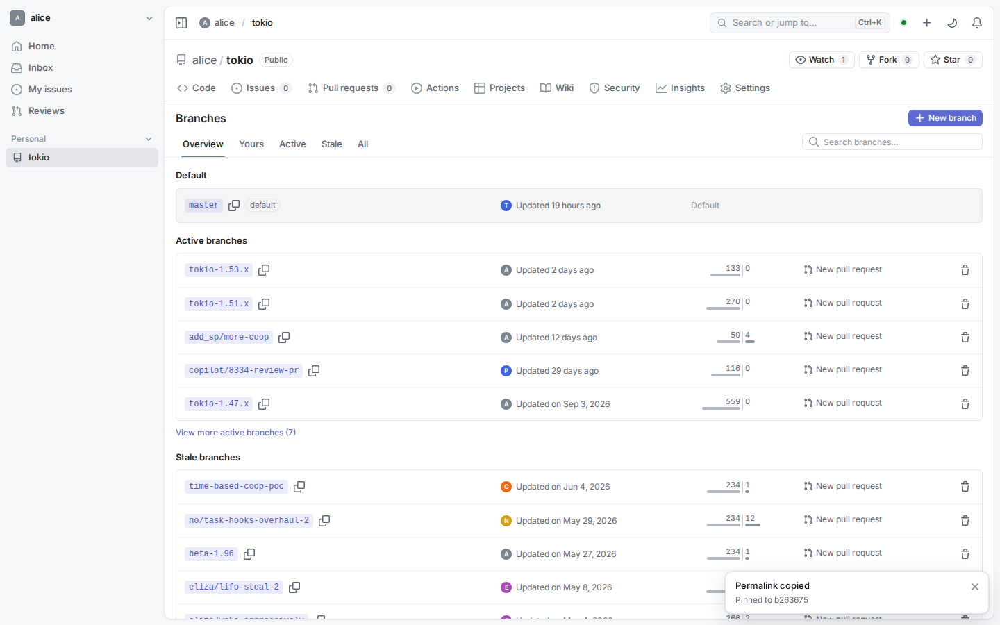

# Package F2: code-web

Branch `bgh/code-web` (from the integration branch, `origin/bgh/git-transport`
merged in). Web client Code tab + three small `/_bgh` endpoints in
`bgh-repos` (`browse/overview.rs`). No migrations.

## Status

Scope complete. Verified against the real backend with a pushed clone of
`tokio-rs/tokio` (4 753 commits, 78 branches, 398 tags): 14/14 Playwright
checks pass, no console errors (see "Verification"). `npm run typecheck`,
`lint`, `test` (89 tests) and `build` (bundle budget OK) pass;
`cargo fmt --check`, `cargo clippy --workspace --all-targets -D warnings`
and `cargo test --workspace --no-fail-fast` pass except the 3 known
bgh-accounts rate-limit tests (integration conflict being fixed on the
integration branch; 102 other test binaries green). Mock mode (`?mock`)
works for every page.

## Pages / routes (`web/src/app/routes.ts`)

| Route | Page | Notes |
|---|---|---|
| `/:o/:r`, `/tree/:ref/*` | `pages/code/CodePage` | repo home (README, About sidebar), directory listing |
| `/blob/:ref/*` | same | file view |
| `/blame/:ref/*` | same | blame |
| `/commits[/:ref/*]` | `pages/commits/CommitsPage` | branch / path history |
| `/commit/:sha` | `pages/commits/CommitPage` | single commit + diff |
| `/branches[/:view]` | `pages/branches/BranchesPage` | overview / yours / active / stale / all |
| `/tags` | `pages/branches/TagsPage` | |
| `/releases`, `/releases/tag/:tag`, `/releases/latest` | `pages/releases/*` | |
| `/releases/new`, `/releases/edit/:tag` | `pages/releases/ReleaseEditPage` | |
| `/edit/:ref/*`, `/new/:ref/*`, `/delete/:ref/*` | `pages/code/edit/EditPage` | in-browser editing |
| `/upload/:ref/*` | `pages/code/edit/UploadPage` | |

`/compare/{base}...{head}` is the PR compare page owned by pulls-web (F4,
`pages/pulls/ComparePage` on `bgh/pulls-web`); this package only links to
it (branches page "New pull request", commit dialog "new branch + PR" →
`?expand=1`). Until pulls-web is integrated that URL falls through to the
generic placeholder.

### Code browser (`pages/code/`)
* **Ref/path resolution by commit SHA** (`util.ts resolveTarget`): `{ref}/{rest}`
  is split against the cached ref list (refs with slashes, e.g.
  `feature/x`, longest branch then tag wins) and the commit SHA is pinned;
  every tree/blob/blame/files fetch then uses the SHA, so responses are
  immutable (client cache never refetches, server sends `immutable`). Route
  prefetch uses the same keys (`app/routes.ts`), so a hovered link renders
  synchronously.
* **Repo home**: last-commit bar (author, message, CI icon, sha, History),
  listing with per-entry last commit (inline or `tree-commits` by SHA),
  rendered README, About sidebar (description, website, topics, readme,
  license, stars/watchers/forks, latest release, contributors, language bar
  with linguist colors), "Go to file", "Code ▾" clone dropdown (HTTPS /
  SSH / GitHub CLI from the REST `clone_url`/`ssh_url`, Download ZIP via
  `/archive/refs/heads/{b}.zip`), empty-repo quick setup.
* **File tree** (left panel, collapsible, `shift+.`): lazy per directory,
  prefetch on hover (dirs → tree, files → blob), ancestors auto-expand.
* **Blob view**: Code / Preview / Blame segmented switch; Markdown (server
  rendered), image, SVG (preview + code), PDF (`<object>`), CSV/TSV table
  (lazy chunk, 1 000 rows), LFS / binary / too large / truncated notices;
  Raw, copy file, download, edit (`.`), menu (copy permalink, copy path,
  history, delete). Line numbers are CSS-generated (copying code doesn't
  copy numbers); click / shift-click selects `#L10-L20` (history
  `replaceState`, no navigation), selection bar with copy permalink (pinned
  to the commit) / copy lines; permalinks scroll into view on load.
  Files > 1 500 lines are virtualized (`@tanstack/react-virtual` against the
  layout scroller, fixed 20 px rows); smaller files stay plain so browser
  find-in-page works.
* **Blame**: per-range commit (date, avatar, summary → commit page), 10-step
  age heatmap (legend), "blame prior to this change" (→ blame at
  `previous.sha` / `previous.path`, `#L{orig_line}`), same virtualization.
* **Shortcuts**: `t` fuzzy file finder (lazy chunk; full path list from
  `/_bgh/…/files/{commit}`, ranked by path + filename score, ↑/↓ prefetch
  the blob), `w` branch/tag picker, `y` expand URL to the commit SHA (and
  copy), `b` toggle blame, `.` edit, `shift+.` toggle tree, `j/k/enter/o`
  and `backspace` (parent) in listings, `esc` clears the line selection.
* **RefPicker** (`components/code/RefPicker`, shared): fuzzy filter,
  Branches/Tags tabs (`tab` switches), keyboard navigation, "Create branch
  X from Y" (POST `git/refs`, push access), links to all branches/tags.

### Commits / branches / tags (`pages/commits`, `pages/branches`)
* Commits list: `/_bgh/…/history` pages of 50, grouped by day, one flat
  `VirtualList`, infinite scroll + "Load more", CI icon per commit from one
  batched `commit-status` call per page, expandable message, verified slot
  (placeholder — compact history has no signature data), copy SHA, browse
  tree at commit; `j/k/enter/o/y`. Path history with breadcrumbs.
* Commit page: message, author/committer, parents, Verified/Unverified
  from REST `verification`, CI, stats, existing `components/diff/DiffViewer`
  fed by `commits/{sha}` `.diff` (immutable for full SHAs), `y` expands an
  abbreviated SHA.
* Branches: overview (default card + top yours/active/stale), tabs, `/`
  search, ahead/behind bars, protected badge, PR state link or "New pull
  request", optimistic delete with "Restore" toast (recreates from the
  SHA), "New branch" dialog (`c`).
* Tags: tag → tree, commit, lazy commit date per visible row, zip/tar.gz,
  release link.

### Releases (`pages/releases`)
List (20/page, Latest / Pre-release / Draft badges, `body_html` or lazy
Markdown, collapsible assets + source archives), single release (edit `e`,
delete with confirm), editor: tag picker or new tag (target branch picker),
previous tag + "Generate release notes", Write/Preview, drag & drop assets
with per-file progress (XHR to `/api/uploads/…/releases/{id}/assets`),
cancel/retry/delete, pre-release / latest (`make_latest`), Publish / Save
draft / Update; new release with files = create draft → upload → publish.

### Editing (`pages/code/edit`, `components/code/CommitDialog`)
Textarea editor (line-number gutter, Tab/Shift+Tab indent, indentation
detection, soft wrap, CRLF + trailing newline preserved), Markdown preview or
line diff preview, rename (single git-data commit), new file with `a/b/c`
breadcrumb path input, delete, upload (drag & drop files/folders, one commit
through `git/blobs` → `git/trees` → `git/commits` → `PATCH git/refs`,
fallback to per-file contents PUT). Commit dialog: directly to the branch
or new `{login}-patch-N` branch + PR compare page; branch-protection
rejection switches to "new branch"; 409 sha conflict → "View latest" /
"Overwrite". Caches for the ref are invalidated after a commit.

## Backend additions (`crates/bgh-repos/src/browse/overview.rs`)

| Endpoint | |
|---|---|
| `GET /_bgh/repos/{o}/{r}/branch-list` | `{default_branch, branches: [{name, commit (CommitSummary), ahead, behind, protected, pull: {number,state,merged,draft,title}|null}]}`; ahead/behind vs default via `rev-list --left-right --count` (8 concurrent), Redis-cached per (default tip, branch tip); newest PR per head ref in one query; ≤ 1 000 branches |
| `GET /_bgh/repos/{o}/{r}/files[/{ref}]` | `{commit, paths[], truncated}` (`ls-tree -r --name-only`, ≤ 100 000), Redis-cached per commit, immutable for SHA refs |
| `GET /_bgh/repos/{o}/{r}/commit-status?sha=…&sha=a,b` | `{statuses: {sha: {state, total, success, failure, pending}}}` from latest commit status per context + latest check run per name (≤ 100 SHAs, existing indexes) |

Test: `crates/bgh-repos/tests/browse.rs::branch_list_files_and_commit_status`.

## Shared-code changes (all additive)
* `web/src/api/code.ts` (new): types + wrappers + `codeKeys`;
  `api/endpoints.ts` unchanged apart from the merge.
* `web/src/ui/icons.ts`: more Octicons exported.
* `web/src/mock/server.ts`: `Ctx.raw` (raw request body for uploads) and
  `installCodeRoutes` registered first (`mock/code.ts`: browse + REST reads
  on a stateful mock git model `mock/git.ts` with branches, tags, releases,
  line blame and unified diffs; `mock/releases.ts`, `mock/contents.ts`).
* `web/src/app/routes.ts`: code-tab routes; code prefetch now keyed by the
  resolved commit SHA (`pages/code/util.ts`).
* `web/scripts/code-real.mjs`: real-backend smoke + timings.
* `web/src/api/client.ts`: requests use `cache: 'no-cache'`. REST responses
  carry `max-age=60` and ref-based `/_bgh` ones `max-age=30`, so after a
  write (release asset upload, commit) the browser HTTP cache served the
  old list even though the app invalidated its own cache (found on the
  real backend). Revalidation is a cheap ETag 304; immutable SHA data stays
  in the in-memory resource cache.

## Verification

Setup (debug build of `bgh`, fresh DB, `BGH_WEB_DIR=web/dist`):
`bgh admin create-user --login alice … --site-admin`, a PAT, `POST
/user/repos` (`tokio`), topics, then `git push` of a bare clone of
`tokio-rs/tokio` (all branches + tags) over smart HTTP. Then
`PLAYWRIGHT_BROWSERS_PATH=/opt/pw-browsers node web/scripts/code-real.mjs
http://127.0.0.1:3000 alice <pw> alice/tokio tokio/src/runtime/builder.rs`.

Also on the real backend: release editor upload (XHR to the uploads
endpoint, CSRF + cookie) of a file onto a release, which then shows in the
list; edit README in the browser → commit dialog → direct commit → the blob
view shows the new commit; generate-notes and publish via the API.

Checks (all pass): repo home (listing, README, about/languages); directory
+ file tree; blob with highlighting and `#L20-L25` selection; blame
(heatmap) via `b`; `t` finder → open; `y` → commit permalink; ref picker
(branches + tags); commits list grouped by day; commit page with diff; file
history; branches; tags; releases; branches → compare links.

Navigation timings (Redis caches flushed first; measured in page from the
click / key press to the first painted row, after a 150 ms hover that
triggers prefetch; 7 `.rs` files in `tokio/src/runtime`; **debug** server
build — the git-transport benchmarks show release is several times faster
for cold highlighting/blame):

| transition | median | max |
|---|---|---|
| tree → file, cold | 48 ms | 168 ms |
| tree → file, warm | 23 ms | 179 ms |
| file → blame, cold (`b`) | 122 ms | 330 ms |
| file → blame, warm | 35 ms | 449 ms |

Bundle: initial JS 122.8 KB gzip (budget 150), largest lazy chunk 40.5 KB
(the mock); CodePage chunk ≈ 13 KB gzip; CSV table and file finder are
separate lazy chunks.

Screenshots (real backend): 
 
 

## Known gaps / TODO
* Release build of the server could not be timed in this container (LTO
  release build OOM-killed); numbers above are from the debug build.
* No symbol outline; no "jump to line" dialog (use `#L` URLs).
* Commits list has no signature data (verified badge is a placeholder slot;
  the commit page shows REST `verification`).
* Router can't block in-app navigation, so unsaved edits are only guarded on
  reload/close (`beforeunload`).
* A failed commit after "create new branch" leaves the new branch behind.
* Releases: no paste-to-upload, asset labels not editable in the UI.
* Mock git state is per page session (not persisted like the sync tables).
* `/compare` depends on pulls-web being integrated.
